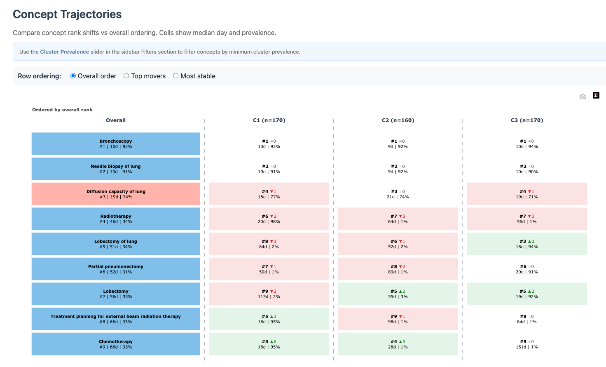

# Trajectories Tab

## Introduction

The **Trajectories** tab compares concept ordering patterns across
clusters using median occurrence timing and prevalence.

Trajectories tab

## Controls

- **Row ordering**:
  - `Overall order`: ranked by overall timing.
  - `Top movers`: emphasizes concepts whose ordering shifts most across
    clusters.
  - `Most stable`: emphasizes concepts with minimal ordering drift.
- **Cluster Prevalence (%)** (sidebar): when a specific cluster is
  selected, filters concepts by minimum within-cluster prevalence.

## Interpretation

- Concepts that move strongly between clusters can indicate
  cluster-defining care pathways.
- Concepts with stable ordering are useful anchors for comparing
  trajectories across cohorts/studies.
- Use this tab together with **Dashboard**: keep only clinically
  relevant concepts active, then inspect temporal ordering stability.
