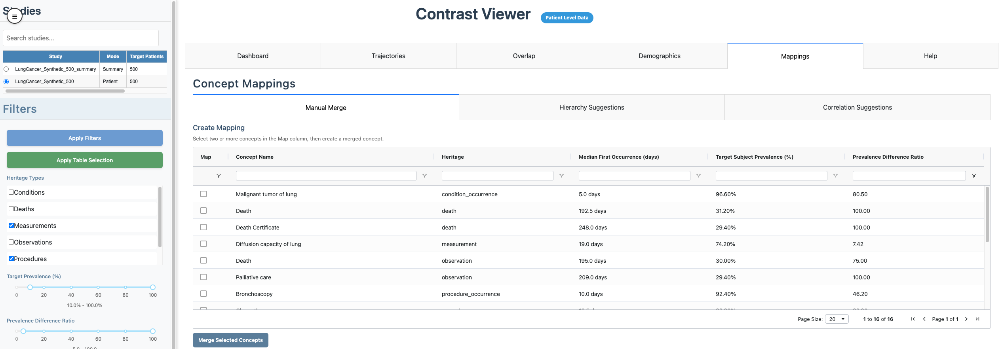
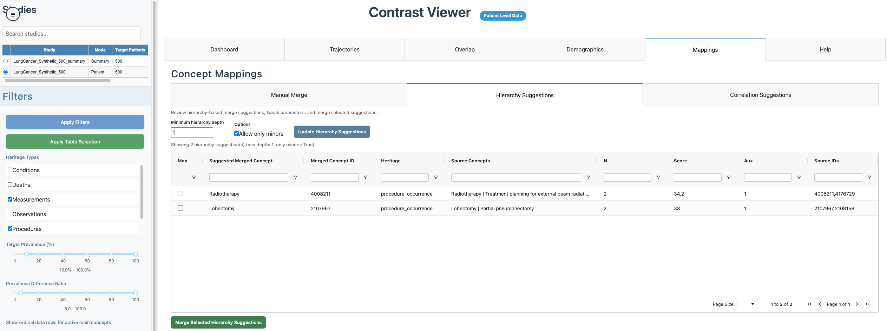

```{r, include = FALSE}
knitr::opts_chunk$set(
  collapse = TRUE,
  comment = "#>"
)
```

## Introduction

After running a study with `createOutputFiles = TRUE` (or generating summaries with `precomputeSummary()`), launch the viewer:

```{r, include = TRUE, eval=FALSE, echo=TRUE}
CohortContrast::runCohortContrastViewer(
  dataDir = file.path(getwd(), "studies")
)
```

## Select a study and mode

Use the **Studies** panel to pick a study. The badge next to the title confirms whether the data is loaded in **Patient Level Data** mode or **Summary Mode**.


## Main workflow in the UI

Recommended order:

1. Select study and confirm data mode.
2. Set filters in the sidebar and click **Apply Filters**.
3. Review the composite chart and table in **Dashboard**.
4. Optionally refine visibility using the table **Show** column and click **Apply Table Selection**.
5. Inspect **Trajectories**, **Overlap**, and **Demographics**.
6. Use **Mappings** (patient mode) for concept merges and review mapping history.

## Tabs

- **Dashboard**: central composite view with enrichment/prevalence, time-to-event, age, sex, and cluster prevalence columns.
- **Trajectories**: concept ordering shifts across clusters.
- **Overlap**: concept co-occurrence matrix and pairwise relationship table.
- **Demographics**: cohort, cluster, and concept-level age/sex summaries.
- **Mappings**: manual and suggestion-based concept merges (patient mode), plus mapping history.
- **Help**: in-app methods and control reference.

See also:

- [Dashboard Composite Plot](https://healthinformaticsut.github.io/CohortContrast/articles/a03_dashboard_composite.html)
- [Trajectories Tab](https://healthinformaticsut.github.io/CohortContrast/articles/a04_trajectories_tab.html)
- [Overlap Tab](https://healthinformaticsut.github.io/CohortContrast/articles/a05_overlap_tab.html)
- [Mappings Tab](https://healthinformaticsut.github.io/CohortContrast/articles/a06_mappings_tab.html)
- [Patient vs Summary Mode](https://healthinformaticsut.github.io/CohortContrast/articles/a07_patient_vs_summary_mode.html)
- [Demographics Tab](https://healthinformaticsut.github.io/CohortContrast/articles/a08_demographics_tab.html)
- [Sidepanel Filters and Controls](https://healthinformaticsut.github.io/CohortContrast/articles/a09_sidepanel_controls.html)
- [Air-gapped Server Setup](https://healthinformaticsut.github.io/CohortContrast/articles/a10_air_gapped_server_setup.html)

## Mappings overview

In patient mode, the **Mappings** tab includes:

- **Manual Merge**: select main concepts in the **Map** column, create a merged concept, and apply.
- **Hierarchy Suggestions**: tune hierarchy parameters, click **Update Hierarchy Suggestions**, then merge selected rows.
- **Correlation Suggestions**: tune correlation parameters, click **Update Correlation Suggestions**, then merge selected rows.
- **Mapping History**: audited list of applied mappings.




