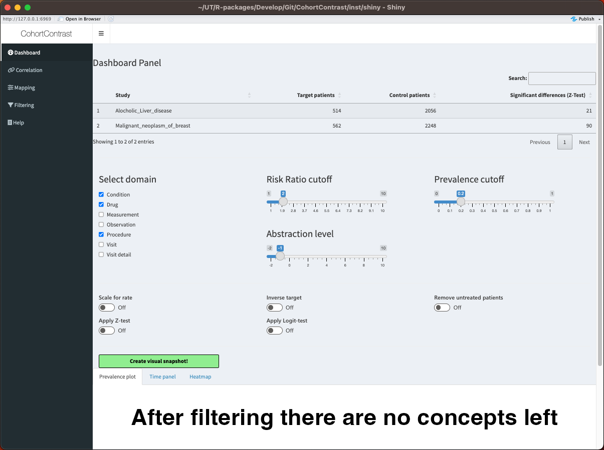
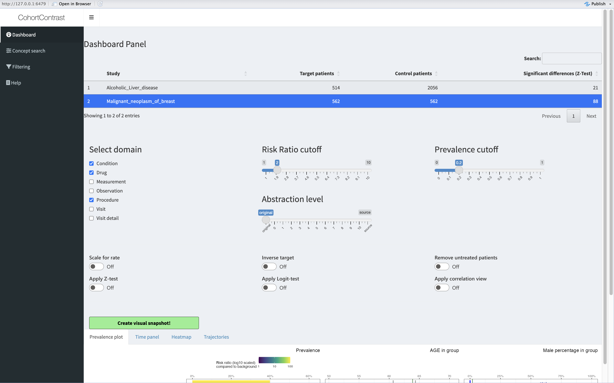
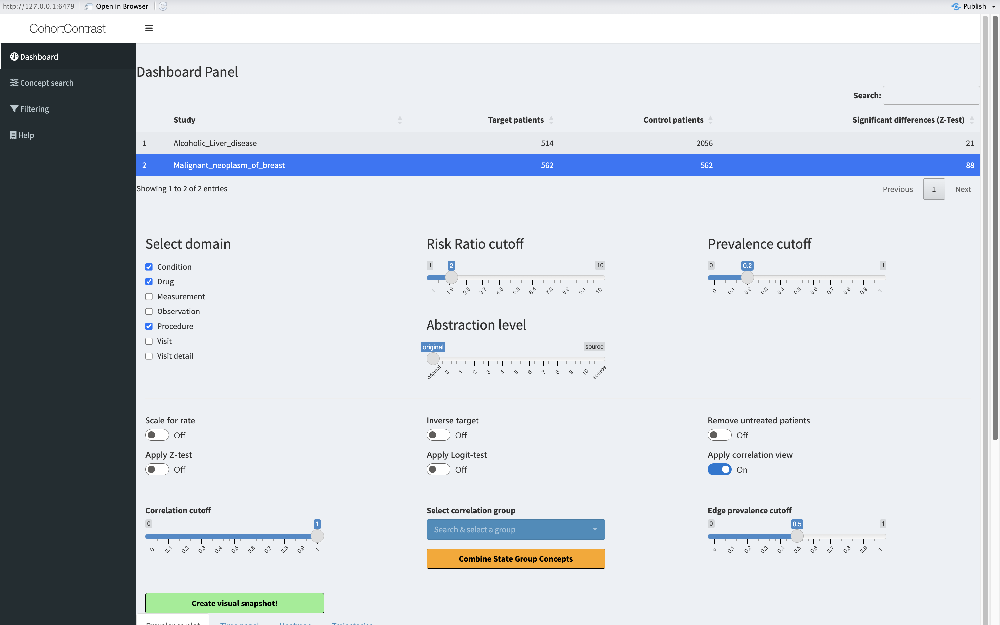
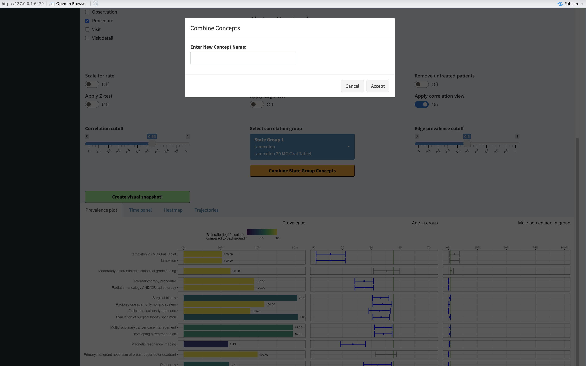
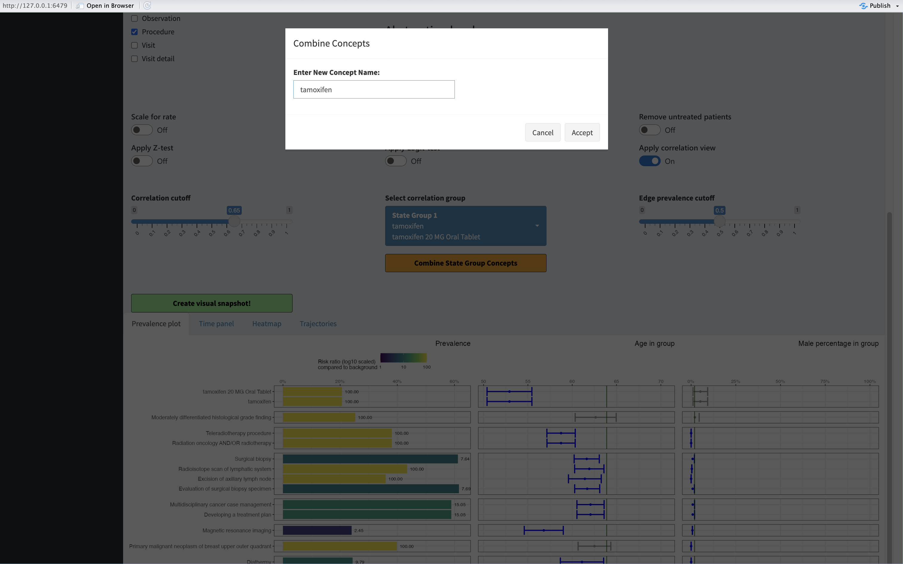
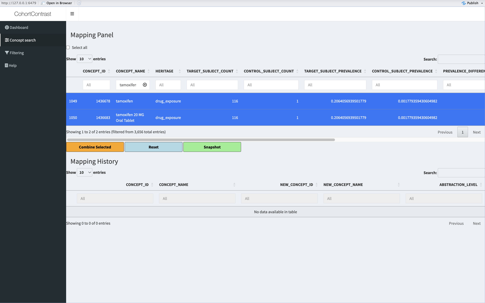

```{r, include = FALSE}
knitr::opts_chunk$set(
  collapse = TRUE,
  comment = "#>"
)
```

## Introduction

If you have successfully executed the study on your target cohort you can explore the results inside the graphical user interface!

```{r, include = TRUE, eval=FALSE, echo=TRUE}
################################################################################
#
# Run the interface
#
#################################################################################
CohortContrast::runCohortContrastGUI(pathToResults = getwd())
```

In this example we have two studies in our `pathToResults` designated folder.



To activate a study, you ***must click on it's name***. Let's activate the breast cancer study view.



## Mapping

You may want to map some concepts together. The 'Correlation' tab helps you to find concept groups which are highly correlated.

  - Concepts might be highly correlated because they mean the same thing (eg metoclopramide as ingredient and as a drug)
  - Concepts might be highly correlated because they are part of the same treatment arm (eg diagnostic biopsy and evaluation of the biopsy)
  


The heatmap shows you the groups of highly correlated concepts. From above you can select a group and combine it.


In this example we combine the metoclopramide derivatives. You can select any name, but a unique one is advised.




You can manually do the same thing under the 'Mapping' tab. Search for concepts you want to combine and click on them to be selected, then press 'Combine Selected'.




You can always press the 'Reset' button to undo your changes. When creating the 'Snapshot' the mappings are also exported as a table.
