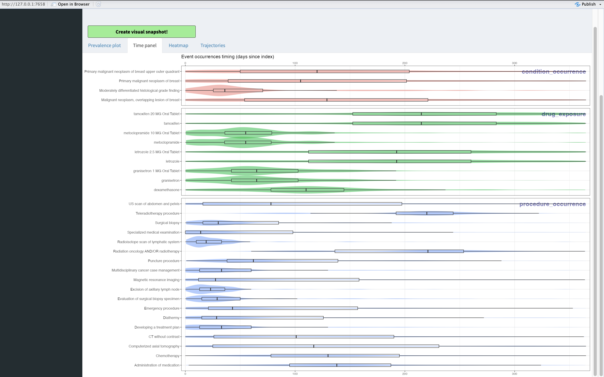

```{r, include = FALSE}
knitr::opts_chunk$set(
  collapse = TRUE,
  comment = "#>"
)
```

## Introduction

Moving on to the Time panel you can see the same concepts as before. The time panel is meant to show you the temporal occurrence of the concepts. Each concept is plotted with a violin plot, to show the density, and a boxplot, to show the meaningful percentiles. On y-axis you have the concepts, on x-axis the time duration in days is shown.



## Interpretation

The concepts are grouped by the domain as in the Prevalence plot.

From the panel multiple things can be taken into account:

* Drugs like metoclopramide, tamoxifen, letrozole, granisetron might have duplicate values as ingredient and drug are reported at the same times.

* Procedures like Developing a treatment plan and Multidiciplinary cancer case management are one of the first procedures when starting a breast cancer trajectory.

* Radiation procedures are one of the latter procedures applied


