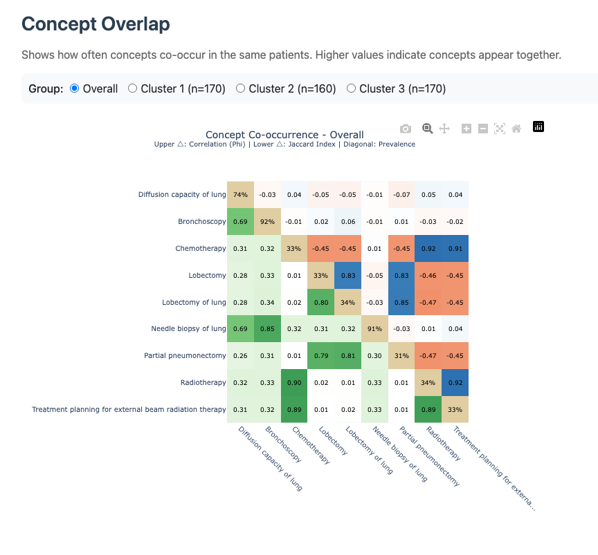
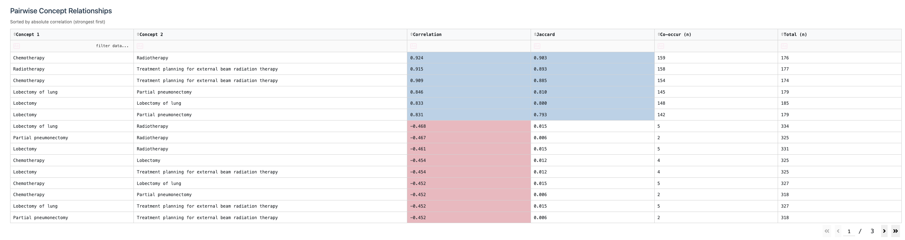

```{r, include = FALSE}
knitr::opts_chunk$set(
  collapse = TRUE,
  comment = "#>"
)
```

## Introduction

The **Overlap** tab shows how often active concepts co-occur in the same patients.



## Components

- **Group selector**: inspect `Overall` behavior or a specific cluster.
- **Overlap visualization**: pairwise concept relationships among currently active concepts.
- **Pairwise table**: sortable/filterable table with metrics such as correlation, Jaccard, and co-occurrence counts.



## Interpretation

- High overlap suggests concepts often appear together in the same patients.
- Compare `Overall` versus cluster-specific overlap to identify cluster-specific treatment or diagnosis bundles.
- Use overlap findings to guide concept merge decisions in the **Mappings** tab.
