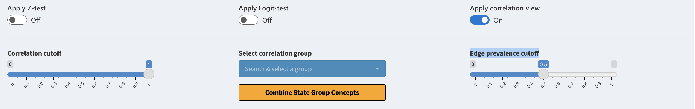
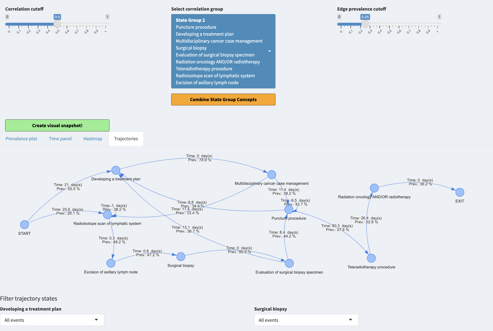
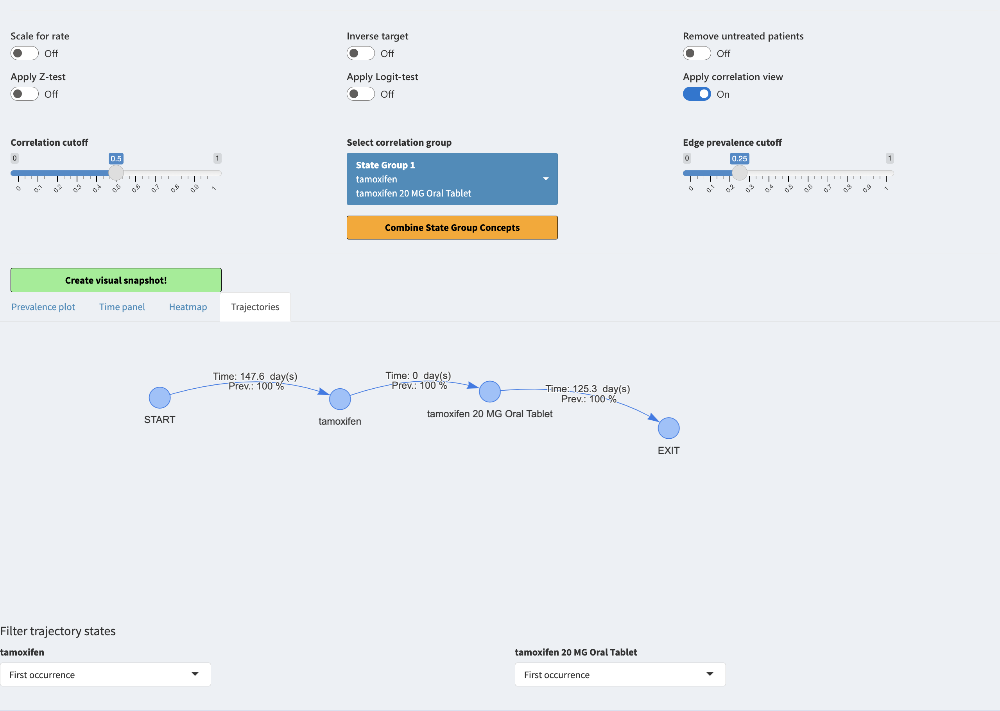

```{r, include = FALSE}
knitr::opts_chunk$set(
  collapse = TRUE,
  comment = "#>"
)
```

## Introduction

We have automated the combining of the concepts. For this we use correlation view which can be applied when toggling "Apply correlation view". This will introduce three new widgets "Correlation cutoff", "Select correlation group" & "Edge prevalence cutoff" as well as a plot tab "Trajectories"

## Correlation groups

As mentioned before, after activating the toggle we will see three new widgets:

* Correlation cutoff is a slider for changing the group internal correlations, the higher the value the stricter the grouping. Given a threshold t and concepts a,b and c which are grouped together by t, means that every combination of correlation pairs between a,b and c have at least the correlation of t.

* Select correlation group is a selector for group to investigate the group further under the "Trajectories" tab, only one can be active at a time.

* Edge prevalence cutoff is a filter for the edges between nodes under the Trajectories tab. If the cutoff is at 0.5 it means that only edges (transitions) that are present for atleast 50% of the patients are shown.



## Interpretation

After toggling for correlation view we can use the Trajectories tab. We set the correlation cutoff to 0.5, selected the largest group of concepts and used the edge prevalence of 25%.


When playing around with the trajectories we can filter each concept to be either represented by all events, first event or last event. We can see that there are divergent flows from the beginning of the trajectory. We can also see that the transition times from one concept to another are not instant, which implies that probably these concepts do not mean the same thing and they should not be combined. 

When selecting another correlation group such as the group of tamoxifen and tamoxifen 20 MG Oral tablet we can see that the treansition is instant implicating that these concepts mean the same thing and might be combined. This is done automatically when pressing "Combine State Group Concepts" button.




When allowing the correlation view other plots will change as well. They will cease to be grouped by domain and will be grouped by the correlation groups.


