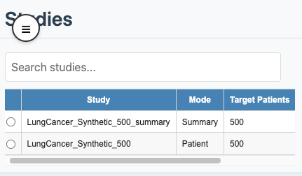

```{r, include = FALSE}
knitr::opts_chunk$set(
  collapse = TRUE,
  comment = "#>"
)
```

## Introduction

CohortContrast Viewer supports two data modes:

- **Patient**: uses patient-level parquet files (for example `data_patients.parquet`).
- **Summary**: uses precomputed aggregate parquet files (for example `concept_summaries.parquet`).

In the **Studies** table, the `Mode` column shows this in one word: `Patient` or `Summary`.



## How each mode is produced

- **Patient mode**: produced directly by `CohortContrast(..., createOutputFiles = TRUE)`.
- **Summary mode**: produced by `precomputeSummary(studyPath = ..., outputPath = ...)`.

The bundled example studies include one patient-mode study and one summary-mode study:

```{r}
patientStudyPath <- system.file("example", "st", "lc500", package = "CohortContrast")
summaryStudyPath <- system.file("example", "st", "lc500s", package = "CohortContrast")

data.frame(
  study = c("lc500", "lc500s"),
  mode = c(
    CohortContrast::checkDataMode(patientStudyPath)$mode,
    CohortContrast::checkDataMode(summaryStudyPath)$mode
  )
)
```

This mirrors the distinction shown in the Viewer study-selection table.

```{r, include = TRUE, eval=FALSE, echo=TRUE}
summary_result <- CohortContrast::precomputeSummary(
  studyPath = file.path(getwd(), "studies", "LungCancer_1Y"),
  outputPath = file.path(getwd(), "studies", "LungCancer_1Y_summary"),
  clusterKValues = c(2, 3, 4, 5),
  minCellCount = 5
)

# Open viewer and load the summary study
CohortContrast::runCohortContrastViewer(
  dataDir = file.path(getwd(), "studies")
)
```

## What is different in the UI

- **Mappings merge actions**:
  - Patient: available (`Manual Merge`, `Hierarchy Suggestions`, `Correlation Suggestions`).
  - Summary: disabled (history is still visible).
- **Clustering updates**:
  - Patient: `Recluster` runs live clustering.
  - Summary: clustering uses precomputed artefacts for selected `k` when filters are applied.
- **Data granularity**:
  - Patient: row-level patient events are available.
  - Summary: only aggregate summaries are available.

## Recommended usage

- Use **Patient** mode for interactive concept curation and merge decisions.
- Use **Summary** mode for faster sharing and reproducible visualization of precomputed results.
