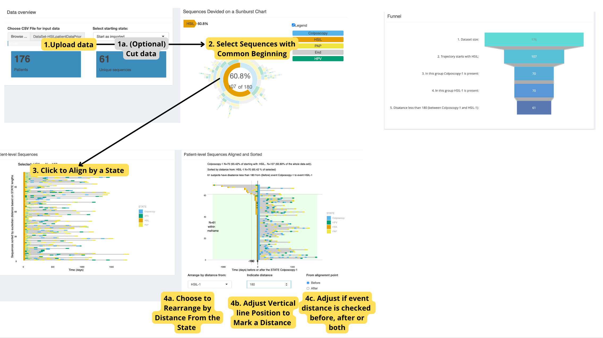

```{r, include = FALSE}
knitr::opts_chunk$set(
  collapse = TRUE,
  comment = "#>"
)
```

## Introduction

[TrajectoryViz](https://github.com/HealthInformaticsUT/TrajectoryViz) is a R package to visualize event sequences as treatment trajectories, it uses the `Cohort2Trajectory` output which was described in the last article.




## Usage

To run the `TrajectoryViz` graphical interface you can use the following wrapper.

```{r, include = TRUE, eval=FALSE, echo=TRUE}
# Initiate database connection & load data
pathToResults <- "./inst/example"
db <- DBI::dbConnect(duckdb::duckdb(), dbdir = CDMConnector::eunomia_dir("GiBleed"))
cdm <- CDMConnector::cdm_from_con(db , cdm_name = "eunomia", cdm_schema = "main", write_schema = "main")
data <- readRDS("./inst/example/example.rds")

# Import raw data for trajectory creation
data <- CohortContrast::createC2TInput(data, cdm)

# Create trajectories
trajectories <- CohortContrast::C2TCaller(
  data,
  pathToResults
)

# Run TrajectoryViz GUI
CohortContrast::runTrajectoryViz(trajectories)
```
