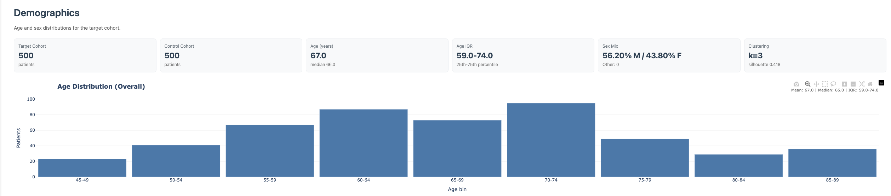
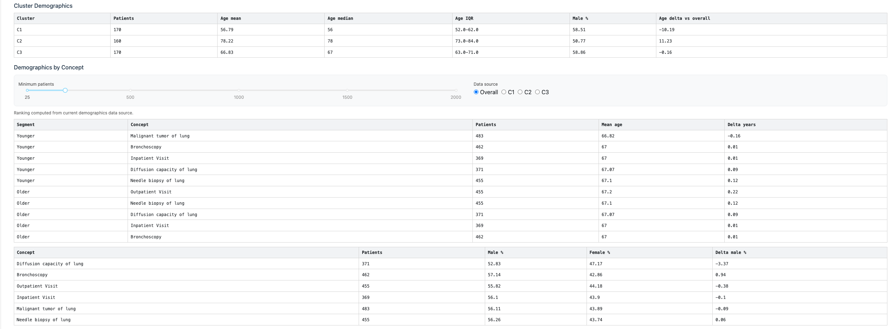
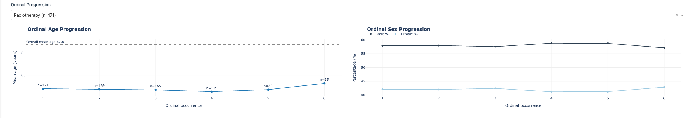

```{r, include = FALSE}
knitr::opts_chunk$set(
  collapse = TRUE,
  comment = "#>"
)
```

## Introduction

The **Demographics** tab summarizes cohort composition and concept-level demographic shifts.

The next example derives a few cohort-level summary values from the bundled `lc500` patient data. These are the same kinds of inputs shown in the KPI cards and demographic overview panels.

```{r}
if (requireNamespace("nanoparquet", quietly = TRUE)) {
  studyDir <- system.file("example", "st", package = "CohortContrast")
  study <- CohortContrast::loadCohortContrastStudy("lc500", pathToResults = studyDir)

  # Summarize overall cohort size and a couple of basic demographic indicators.
  data.frame(
    n_patients = nrow(study$data_person),
    median_birth_year = stats::median(study$data_person$YEAR_OF_BIRTH),
    male_proportion = mean(study$data_person$GENDER_CONCEPT_ID == 8507)
  )
}
```

The full Demographics tab expands this with cluster-specific summaries and concept-level age and sex shifts.



## Components

- **KPI cards**: cohort-level snapshot (patient count, age, sex proportions).
- **Age distribution chart**: cohort age profile with autoscaled axis range.
- **Cluster Demographics table**: per-cluster patient count and age/sex metrics.
- **Demographics by Concept**:
  - age-delta ranking table,
  - sex-skew ranking table,
  - filters for minimum patients and data source.
- **Ordinal Progression**: concept-specific age and sex patterns across ordinal events.



## Controls

- **Minimum patients**: excludes low-support concepts from rankings.
- **Data source**: switches between overall and cluster-specific demographic summaries.
- **Ordinal concept selector**: chooses the concept for ordinal progression charts.



## Patient vs Summary mode behavior

- **Patient mode**: metrics are computed from patient-level event data.
- **Summary mode**: metrics are read from precomputed summary artifacts.

Both modes use the same tab layout and output structure to keep interpretation consistent.

## Interpretation

- Large age deltas highlight concepts concentrated in younger/older subgroups.
- Male/female skew can reveal cohort heterogeneity by intervention or diagnosis context.
- Ordinal progression helps distinguish early vs late events in longitudinal patterns.
