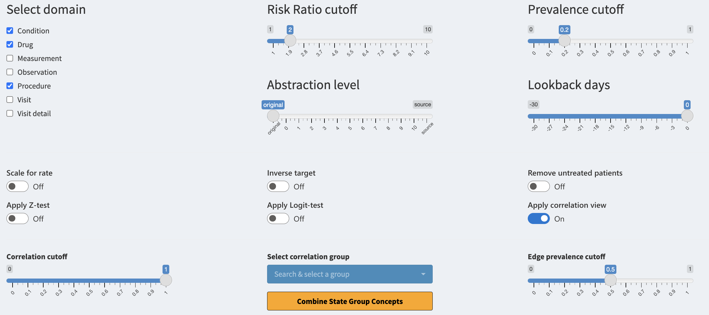

```{r, include = FALSE}
knitr::opts_chunk$set(
  collapse = TRUE,
  comment = "#>"
)
```

## Interface controls

There are multiple interface controls we have not yet elaborated on. Let us go over them one-by-one.



#### Select domain
The 'Select domain' checkbox consists of all the domains supported by the package. When selecting a domain, all of its concepts become available for filtering. You will see the concepts only if they also fulfill the other active filters. When deselecting, the domain is hidden. If you want to use a domain, make sure to include it in the `domainsIncluded` parameter when executing the [study function](https://healthinformaticsut.github.io/CohortContrast/articles/a01_execution.html).

#### Risk Ratio cutoff
The 'Risk Ratio cutoff' slider helps you to conveniently filter the data based on the risk ratio of the concept. The risk ratio is calculated between the target and control cohorts. Risk ratio of 1 means that the risk of the concept occurring is the same for both cohorts, a ratio of 2 means that the concept has double the risk in target cohort. The risk ratio only compares the number of patients with the concept not the total number of concepts occurring.

#### Prevalence cutoff
The 'Prevalence cutoff' slider helps you to filter for more prevalent concepts in target group. If the slider is set to 0.2 you will only see concepts that are present for at least 20% of the patients in the target cohort. This is a convenient way to remove very patient specific concepts which may be regarded as noise. 

#### Abstraction level
The 'Abstraction level' slider helps you to jump between differing levels of concept abstraction. The levels are calculated based on the concept hierarchy inside the CDM vocabulary. The level of "original" references the concepts which are used (mapped) inside the CDM. The level of "source" references the concept source codes used for mapping the data. The levels from 0-10 reference different hierarchical levels, where 0 is the highest level of abstraction for concepts (less specific) while 10 is the lowest level of abstraction (very detailed). This is useful for combining the concepts in a fast manner. For levareging the abstraction levels make sure to set the  `getAllAbstractions` and `getSourceData` equal to `TRUE` and for differing abstraction levels set the `maximumAbstractionLevel` to a sufficient level (max 10) when running [CohortContrast](https://healthinformaticsut.github.io/CohortContrast/reference/CohortContrast.html).

#### Lookback days
The 'Lookback days' slider is for interactively stretching the start date of the target cohort. This is visible only if the `lookbackDays` is specified when running [CohortContrast](https://healthinformaticsut.github.io/CohortContrast/reference/CohortContrast.html). This is useful for seeing what happens before the patients' get included in the target cohort. This can be also achieved when subtracting the number of days from the target cohort definition during intitiating the cohorts.

#### Scale for rate
The 'Scale for rate' toggle changes the way we treat the risk ratio. If toggled the total number of a concept occurring will be taken into account. This means that a patient with five occurrances of a concept will contribute five times more than before. This helps you to see if a concept is used more frequently inside the target cohort when comparing to control.

#### Inverse target
The 'Inverse target' toggle will switch the target cohort and control cohort. The analysis is shown to you in reverse.

#### Remove untreated patients
The 'Remove untreated patients' toggle will remove all patients from the plots who have not been exposed to the concepts shown.

#### Apply Z-test
The 'Apply Z-test' toggle will filter for concepts which have passed the Z-test. This is a statistical test for comparing the prevalence difference between the cohorts. If true, the test indicates that the underlying distributions of the concept are different.

#### Apply Logit-test
The 'Apply Logit-test' toggle will filter for concepts which have passed the Logit-test. This is a statistical test which builds a logistic regression model for predicting if a person is from target or control cohort based on the prevalence of the concept. If true, the test indicates that the prevalence of the concept is a good predictor for claiming the patient to one of the cohorts.

#### Apply correlation view
The 'Apply correlation view' toggle will activate the correlation view. Now concepts are no longer grouped by domains instead groups of internal correlation are used. The following three controls will affect the view. 

#### Correlation cutoff
The 'Correlation cutoff' slider will create the concept correlation groups based on this value. If the slider's value is 0.8 then all concepts which have correlation of 0.8 (or higher) between each other are grouped together. This can help the user find duplicate concepts as well as concepts which belong into the same treatment arm. 

#### Select correlation group
The 'Select correlation group' selection is mandatory for the 'Trajectories' view. If a group is selected the same group will be visualized as a trajectory under the 'Trajectories' tab. You can also quickly combine the concepts' names of the selected correlation group if you press on the 'Combine Group Concepts' button.

#### Edge prevalence cutoff
The 'Edge prevalence cutoff' slider will affect the edges shown in the 'Trajectories' tab, A value of 0.5 means that only the edges (transitions) which are present for more than 50% of patients are shown on the plot.

