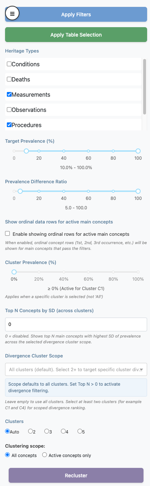

```{r, include = FALSE}
knitr::opts_chunk$set(
  collapse = TRUE,
  comment = "#>"
)
```

## Introduction

This vignette documents the **left sidepanel controls** in the Viewer and how they interact.



## Important model: staged vs applied

Most sidepanel inputs are **staged** until you click **Apply Filters**.

- Moving sliders, changing heritage checkboxes, changing cluster count, or editing Top N does not immediately recalculate active concepts.
- **Apply Filters** is the commit action for filter state.
- **Apply Table Selection** is the commit action for manual `Show` checkbox edits made in the Dashboard table.

## Action buttons

### Apply Filters

Recomputes concept visibility from sidepanel criteria:

- Heritage Types
- Target Prevalence range
- Prevalence Difference Ratio range
- Ordinal-row visibility rule

Then plot-level filtering is applied (cluster prevalence / Top N by SD) when rendering the dashboard.

### Apply Table Selection

Persists manual table `Show` values as active visibility state.

Special rule:

- if an ordinal row is set to `Show = TRUE`, its linked main concept is also forced to `TRUE`.

### Recluster

Runs live reclustering only in **Patient** mode.

- In **Summary** mode this button is disabled.
- Summary clustering changes are applied when **Apply Filters** is pressed with the selected cluster count.

## Sidepanel controls

### Heritage Types

Domain-family include/exclude control.

- If a heritage is unchecked, its concepts are excluded.
- If all are unchecked, the app falls back to treating this as “all heritages selected”.

### Target Prevalence (%)

Range filter on target cohort prevalence.

- Keeps concepts with `TARGET_SUBJECT_PREVALENCE_PCT` inside the selected range.

### Prevalence Difference Ratio

Range filter on contrast effect size.

- Keeps concepts with `PREVALENCE_DIFFERENCE_RATIO_DISPLAY` inside the selected range.

### Show ordinal data rows for active main concepts

Toggles whether ordinal rows are shown.

- ON: ordinal rows can be shown, but only for main concepts that are active.
- OFF: all ordinal rows are hidden.

### Cluster Prevalence (%)

Minimum prevalence threshold within the currently selected cluster view.

- Active only when Dashboard view is a specific cluster (`C1`, `C2`, ...).
- Inactive when view is `All`.

### Top N Concepts by SD (across clusters)

Keeps only the top N **main concepts** with highest prevalence SD across clusters.

- `0` disables this filter.
- Applied **last** in filtering order.
- Ordinal rows are removed when this filter is active.

### Divergence Cluster Scope

Optional cluster subset used by Top N by SD ranking.

- Empty = all clusters.
- Select at least two clusters for scoped divergence ranking.

### Clusters

Selects cluster count (`Auto`, `2`, `3`, `4`, `5`).

- Changing this input alone does not run clustering.
- Requires **Recluster** (patient mode) or **Apply Filters** (summary mode).

### Clustering scope

Controls whether clustering uses:

- `All concepts`
- `Active concepts only`

Only relevant in patient mode; visually disabled in summary mode.

## Override and precedence rules

1. **Apply Filters** overrides manual table visibility edits by recomputing `_show` from filter criteria.
2. **Apply Table Selection** can be used after filtering to apply additional manual curation.
3. **Cluster count change alone does nothing** until a clustering commit action occurs.
4. **Top N by SD** is applied after other filters and can further shrink the visible concept set.
5. **Cluster Prevalence (%)** applies only for a specific selected cluster view.

## Mode-specific behavior

### Patient mode

- `Recluster` is enabled.
- Cluster assignments and summaries are recomputed live.
- Clustering scope (`All concepts` vs `Active concepts only`) is active.

### Summary mode

- `Recluster` is disabled.
- Precomputed clustering artifacts are used.
- Selected cluster count is applied on **Apply Filters**.

## Recommended operating sequence

1. Set sidepanel criteria.
2. Click **Apply Filters**.
3. Optionally edit Dashboard `Show` values manually.
4. Click **Apply Table Selection**.
5. If needed, change clustering settings and commit appropriately by mode.
